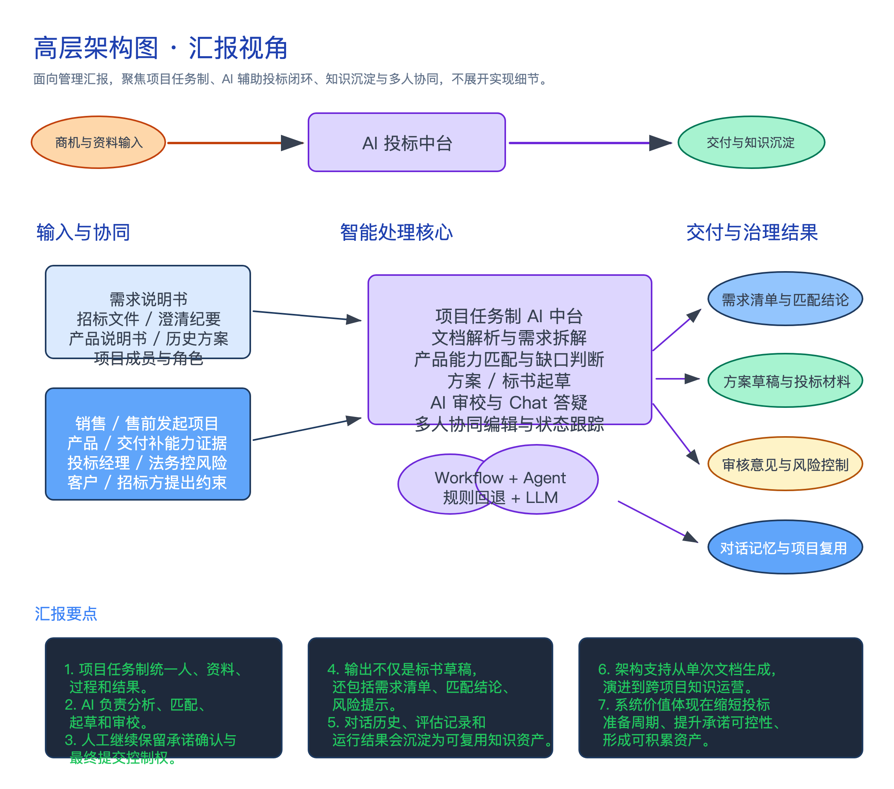
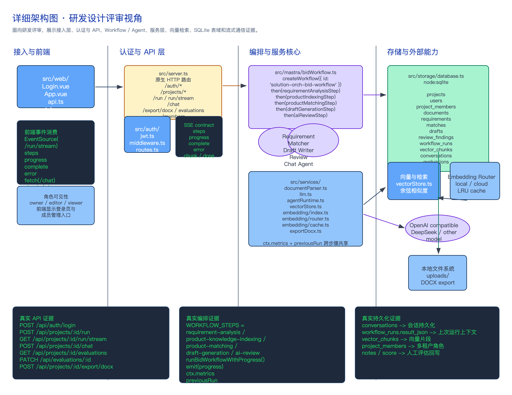

# 需求到投标智能方案生成 Agent

## 项目简介

这是一个从需求文档到解决方案/投标材料草稿的端到端原型。系统通过 Vue3 工作台上传需求、招标和产品资料，后端执行文档解析、需求抽取、产品匹配、方案生成和 AI 审核流程，最终提供可编辑草稿与 DOCX 导出。

**七期更新**：多 Agent 记忆提升——会话持久化（conversations 表，服务重启不丢对话）+ 跨 Agent 共享上下文（metrics + previousRun，步骤间信息贯通）。

## 技术栈

- 前端：Vue3 + Vite + TypeScript
- 后端：Node.js + TypeScript 原生 HTTP 服务
- Agent 编排：Mastra Workflow（`createStep` + `createWorkflow`）+ Mastra Agent
- LLM：DeepSeek v4 Pro（OpenAI 兼容 API）
- Embedding：三层解耦架构（接口抽象 + 策略路由 + LRU 缓存），本地/云端双 provider
- 实时通信：SSE（Server-Sent Events）
- 向量检索：余弦相似度 + SQLite 向量存储
- 认证鉴权：JWT HS256（`node:crypto`）+ SHA256 密码哈希，三级角色
- 数据存储：Node 24 `node:sqlite`
- 文档解析：`mammoth`、`xlsx`、`pdf-parse`
- 导出：`docx`
- 测试：Vitest

## 架构视图

### 应用架构视图

面向业务汇报，突出项目任务制、AI 投标中台和交付沉淀闭环。



### 业务/研发架构视图

面向研发评审，展示前端、API、Workflow/Agent、服务层、存储和外部模型能力之间的关系。



## 核心流程

1. 创建投标/方案项目。
2. 上传需求/招标文档、产品资料和参考材料。
3. 解析 Word、Excel、PDF 或文本内容。
4. LLM / 规则抽取结构化需求清单。
5. LLM 语义 / 关键词从产品资料生成知识片段，可选向量嵌入。
6. 向量检索 / LLM 逐条 / TF 评分按需求匹配产品能力，标记满足、部分满足或缺口。
7. LLM / 模板生成解决方案草稿和投标材料草稿。
8. LLM 多维 / 规则输出 AI 审核意见，提示遗漏、证据不足和风险承诺。
9. 人工编辑草稿并导出 DOCX。

## 目录说明

```text
docs/            项目文档
samples/         示例需求和产品资料
src/auth/        JWT 签发/验证、鉴权中间件、登录注册路由
src/agents/      专家 Agent 逻辑（LLM 语义 + 规则回退 + 对话引擎）
src/mastra/      端到端 Workflow 封装
src/mastra/steps/ Mastra Step 定义（每 Agent 对应一个 Step）
src/services/    文档解析、LLM、Agent Runtime、Embedding（三层解耦）、VectorStore、DOCX 导出
src/storage/     SQLite 数据层（9 表：含用户、成员、向量块、评估、对话历史）
src/web/         Vue3 工作台（登录/注册 + 进度面板 + 对话面板 + 评估面板）
tests/           单元与集成测试（15 文件、55 用例）
```

## 本地启动

安装依赖：

```bash
npm install
```

启动前后端开发服务：

```bash
npm run dev
```

默认地址：

- 前端：http://localhost:5173/
- API：http://127.0.0.1:8787

## 环境变量

参考 `.env.example`：

```bash
# LLM 配置（可选，不配置时走规则逻辑）
OPENAI_COMPAT_BASE_URL=https://api.deepseek.com/v1
OPENAI_COMPAT_API_KEY=
OPENAI_COMPAT_MODEL=deepseek-chat

# Embedding 配置（可选，云端 provider；不配置时走本地 provider）
OPENAI_EMBEDDING_API_KEY=
OPENAI_EMBEDDING_MODEL=text-embedding-3-small

# 评估模式开关（默认关闭）
ENABLE_EVALUATION=false

# 认证配置（可选，不配置时跳过鉴权）
JWT_SECRET=

# 服务配置
API_HOST=127.0.0.1
API_PORT=8787
DATA_DIR=.data
```

当前原型默认使用确定性规则生成结果，即使未配置模型密钥也能完成端到端演示。不要把真实密钥写入代码、文档或提交记录。

- 配置 LLM API Key 后，所有 Agent 自动切换到 LLM 语义模式。
- Embedding 三层架构：本地 provider 始终可用，配置云端 API Key 后根据数据安全等级自动路由（`internal/confidential → local`，`public → cloud`）。
- 设置 `ENABLE_EVALUATION=true` 后，每次运行自动记录评估快照，可在前端评分对比。
- 配置 `JWT_SECRET` 后启用多租户认证，前端显示登录/注册页，API 按角色鉴权。

## 使用示例

1. 打开前端工作台。
2. 创建项目。
3. 上传 `samples/requirement.txt`，类型选择"需求/招标"。
4. 上传 `samples/product.txt`，类型选择"产品资料"。
5. 点击"运行流程"。
6. 查看需求清单、产品匹配、草稿编辑和 AI 审核意见。
7. 点击"导出 DOCX"获取可编辑文档。

## 验证命令

运行测试：

```bash
npm test
```

运行构建：

```bash
npm run build
```

当前覆盖（15 文件、55 用例）：

- 文档解析归一化
- 需求抽取（LLM + 规则回退）
- 产品知识与匹配（LLM + 规则回退 + 向量检索）
- 草稿生成和审核意见（LLM + 规则回退）
- LLM 客户端及 Agent LLM 模式
- Embedding 三层解耦（接口、路由策略、LRU 缓存）
- 向量存储 CRUD + 相似搜索
- 评估数据模型（存储、查询、评分、更新）
- 多租户认证（JWT 签发/验证、用户 CRUD、成员管理、角色检查）
- 会话持久化（对话历史读写、重启恢复）
- 跨 Agent 共享上下文（metrics + previousRun）
- Workflow 步骤定义与流式执行
- Chat Agent 模块基础逻辑
- SQLite 存储集成
- 敏感信息脱敏

## API 概览

- `POST /api/auth/login`
- `POST /api/auth/register`
- `GET /api/health`
- `GET /api/projects`
- `POST /api/projects`
- `GET /api/projects/:id`
- `GET /api/projects/:id/members`
- `POST /api/projects/:id/members`
- `DELETE /api/projects/:id/members/:userId`
- `DELETE /api/projects/:id`
- `POST /api/projects/:id/documents`
- `POST /api/projects/:id/run`
- `GET /api/projects/:id/run/stream`（SSE 流式执行）
- `POST /api/projects/:id/chat`（SSE 对话）
- `GET /api/projects/:id/requirements`
- `GET /api/projects/:id/matches`
- `GET /api/projects/:id/drafts`
- `PATCH /api/projects/:id/drafts/:draftId`
- `GET /api/projects/:id/review`
- `GET /api/projects/:id/evaluations`
- `PATCH /api/evaluations/:id`
- `POST /api/projects/:id/export/docx`

## 注意事项

- 需要 Node.js 24 以上版本，因为项目使用 `node:sqlite`。
- `node:sqlite` 当前会打印 ExperimentalWarning，测试已覆盖基本读写行为。
- `.data/`、`dist/`、`node_modules/` 和 `.env` 已在 `.gitignore` 中忽略。
- API 返回会隐藏服务端上传文件路径，避免把本地路径暴露给前端。
- LLM 调用使用原生 `fetch`，无需额外 SDK 依赖。
